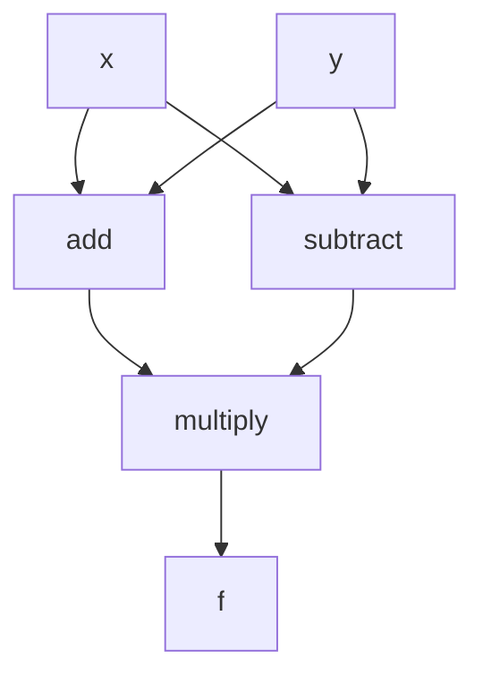
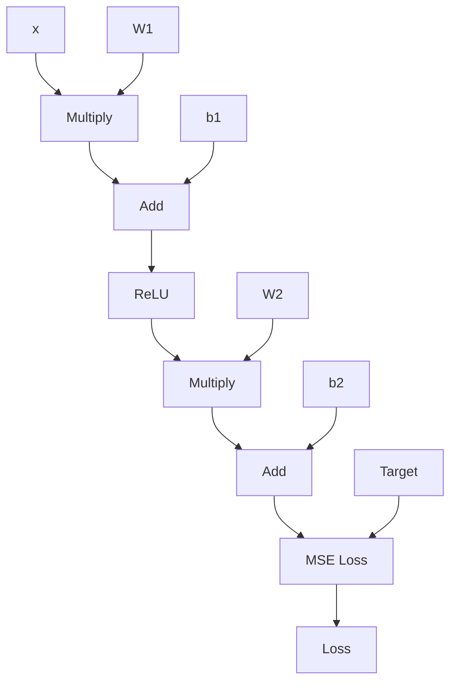

# Computational Graphs, Gradient Calculation, and Automatic Differentiation in Neural Networks

## 1. Gradient Calculation

Gradient calculation is fundamental to optimization in machine learning, especially for training neural networks.

- **Definition**: The gradient is a vector of partial derivatives. For a function f(x1, x2, ..., xn), the gradient is (∂f/∂x1, ∂f/∂x2, ..., ∂f/∂xn).
- **In Machine Learning**: We typically calculate gradients of a loss function with respect to model parameters.
- **Purpose**: Gradients indicate the direction and magnitude of the steepest increase in a function. In optimization, we use this to find the direction of steepest descent to minimize the loss function.
- **Example**: For a simple linear function y = wx + b, we calculate ∂y/∂w and ∂y/∂b to update w and b during training.

## 2. Computational Graphs

A computational graph is a way to represent a mathematical expression as a graph structure. It's crucial for understanding how automatic differentiation works.

### Key aspects:
- **Nodes**: Represent variables or operations.
- **Edges**: Represent the flow of data between nodes.
- **Forward Pass**: Computes the result of the expression.
- **Backward Pass**: Computes gradients using the chain rule.

### Simple Example: f(x, y) = (x + y) * (x - y)



### Complex Example: Simple Neural Network

Consider a neural network with:
- Input x
- Hidden layer with weights W1 and bias b1
- Output layer with weights W2 and bias b2
- ReLU activation function for the hidden layer
- Mean Squared Error (MSE) loss



## 3. Automatic Differentiation (Autodiff)

Automatic differentiation is a key feature of modern deep learning frameworks like PyTorch.

### How Autodiff Works:
1. Builds a computational graph of operations as you define and execute your model.
2. Each operation in this graph knows how to compute its own local gradient.
3. When `.backward()` is called on a loss value, the framework automatically traverses this graph backwards.
4. It applies the chain rule of calculus, combining these local gradients to compute the full gradient of the loss with respect to all parameters.

### Benefits:
- Simplifies implementation: No need to manually derive and code gradient calculations.
- Reduces errors: Eliminates human error in deriving complex gradients.
- Enables complex architectures: Makes it feasible to experiment with and optimize very deep or intricate neural network structures.
- Dynamic computation: Allows for dynamic computational graphs, enabling more flexible model designs.

### Example in PyTorch:

```python
import torch

x = torch.tensor([2.0], requires_grad=True)
y = x**2 + 3*x + 1
y.backward()

print(x.grad)  # Should print tensor([7.]) (dy/dx = 2x + 3)
```

## 4. Importance in Neural Networks

Computational graphs and automatic differentiation are crucial for neural networks because:

1. They visually represent complex mathematical operations.
2. They make it clear how data flows through the model.
3. They show the dependencies required for gradient calculation.
4. They enable automatic differentiation systems to efficiently compute gradients.

This allows frameworks like PyTorch to handle the complex process of backpropagation automatically. When you call `loss.backward()`, it computes all the necessary gradients for you, making it much easier to implement and train neural networks with millions of parameters.

