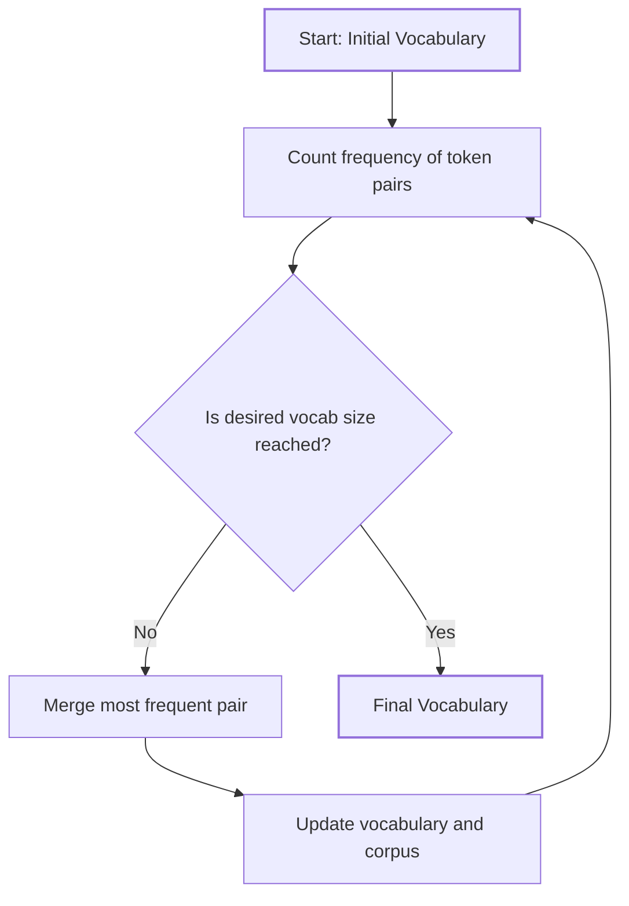
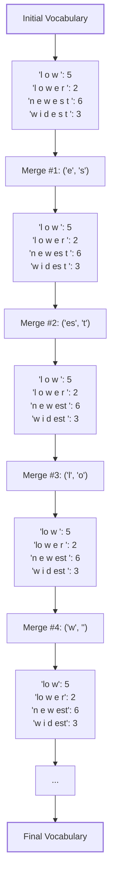

# Comprehensive Byte-Pair Encoding (BPE) Tutorial

## Table of Contents
1. [Introduction](#1-introduction)
2. [Concept](#2-concept)
3. [Algorithm](#3-algorithm)
4. [Visual Representation](#4-visual-representation)
5. [Implementation](#5-implementation)
6. [Example Walkthrough](#6-example-walkthrough)
7. [Practical Considerations](#7-practical-considerations)
8. [Applications in NLP](#8-applications-in-nlp)
9. [Advantages and Limitations](#9-advantages-and-limitations)
10. [Conclusion](#10-conclusion)
11. [Further Reading](#11-further-reading)

## 1. Introduction

Byte-Pair Encoding (BPE) is a data compression technique that has found widespread use in Natural Language Processing (NLP), particularly in tokenization for machine learning models. This tutorial will guide you through the concept, implementation, and applications of BPE.

## 2. Concept

BPE is an iterative algorithm that starts with a vocabulary of individual characters and progressively merges the most frequent pairs of adjacent tokens to form new tokens. This process continues until a desired vocabulary size is reached or no more merges are possible.

## 3. Algorithm

Here's a step-by-step breakdown of the BPE algorithm:

1. Initialize the vocabulary with individual characters from the training corpus.
2. Count the frequency of adjacent pairs of tokens in the corpus.
3. Merge the most frequent pair and add it to the vocabulary.
4. Update the corpus by replacing all occurrences of the merged pair.
5. Repeat steps 2-4 until a stopping criterion is met (e.g., desired vocabulary size).

## 4. Visual Representation

Here's a flowchart representing the BPE process:



This diagram illustrates the iterative nature of the BPE algorithm, showing how it continually updates the vocabulary until the desired size is reached.

## 5. Implementation

Let's implement a simple version of BPE in Python:

```python
from collections import defaultdict

def get_stats(vocab):
    pairs = defaultdict(int)
    for word, freq in vocab.items():
        symbols = word.split()
        for i in range(len(symbols) - 1):
            pairs[symbols[i], symbols[i + 1]] += freq
    return pairs

def merge_vocab(pair, v_in):
    v_out = {}
    bigram = ' '.join(pair)
    replacement = ''.join(pair)
    for word in v_in:
        w_out = word.replace(bigram, replacement)
        v_out[w_out] = v_in[word]
    return v_out

def byte_pair_encoding(vocab, num_merges):
    for i in range(num_merges):
        pairs = get_stats(vocab)
        if not pairs:
            break
        best = max(pairs, key=pairs.get)
        vocab = merge_vocab(best, vocab)
        print(f"Merge #{i+1}: {best}")
    return vocab

# Example usage
vocab = {'l o w </w>': 5, 'l o w e r </w>': 2, 'n e w e s t </w>': 6, 'w i d e s t </w>': 3}
num_merges = 10

final_vocab = byte_pair_encoding(vocab, num_merges)
print("Final vocabulary:", final_vocab)
```

## 6. Example Walkthrough

Let's visualize how the BPE process works on our example vocabulary:



This diagram shows the first few steps of the BPE process on our example vocabulary:

1. We start with the initial vocabulary.
2. In the first merge, 'e' and 's' are combined as they appear most frequently together.
3. Next, 'es' and 't' are merged.
4. Then 'l' and 'o' are merged.
5. The process continues with 'w' and '</w>' being merged.

The algorithm would continue until no more merges are possible or the specified number of merges (10 in this case) is reached.

This example demonstrates how BPE gradually builds up larger subword units from frequent character pairs, allowing it to efficiently represent common subwords while still maintaining the ability to tokenize rare or unseen words.

## 7. Practical Considerations

- **Vocabulary Size**: The choice of vocabulary size is crucial. Too small, and you lose important information; too large, and you risk overfitting.
- **Handling Unknown Tokens**: BPE can handle unknown words by breaking them into known subwords.
- **Preprocessing**: It's often beneficial to add end-of-word tokens (like '</w>') to preserve word boundaries.

## 8. Applications in NLP

BPE is widely used in various NLP tasks:

- **Machine Translation**: Helps handle rare words and improves translation quality.
- **Language Modeling**: Used in models like GPT for efficient tokenization.
- **Text Classification**: Can improve performance on tasks with limited vocabulary.

## 9. Advantages and Limitations

Advantages:
- Balances word-level and character-level representations
- Handles rare and out-of-vocabulary words well
- Language-agnostic

Limitations:
- Can sometimes produce unintuitive subword units
- Requires careful tuning of hyperparameters

## 10. Conclusion

Byte-Pair Encoding is a powerful technique that has significantly improved the performance of many NLP models. By understanding and implementing BPE, you can enhance your text processing pipelines and build more effective NLP systems.

## 11. Further Reading

- Sennrich, R., Haddow, B., & Birch, A. (2016). Neural Machine Translation of Rare Words with Subword Units.
- The official OpenAI GPT-2 tokenizer implementation
- Google's SentencePiece library, which includes BPE implementation

